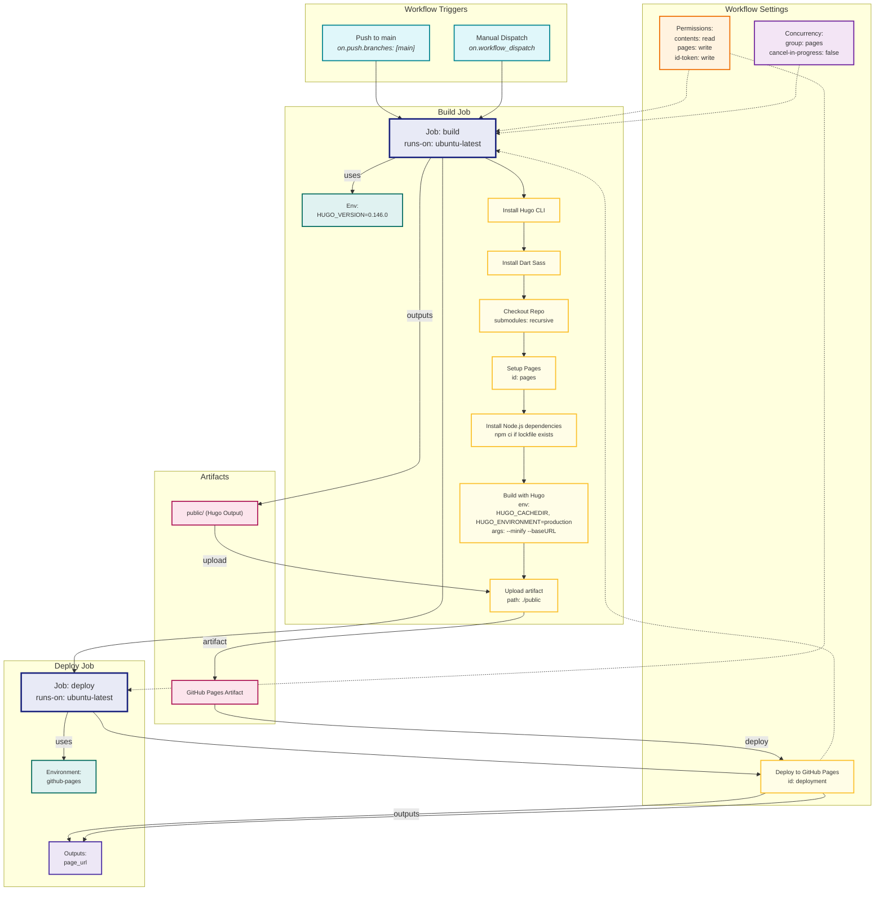

# Howard Jiang's Personal Website

This repository contains the source code and content for Howard Jiang's personal website, built with [Hugo](https://gohugo.io/) and the [PaperMod](https://github.com/adityatelange/hugo-PaperMod) theme.

## Purpose

The website serves as a digital portfolio, showcasing Howard's education, experience, projects, publications, presentations, certifications, and more. It is designed to be fast, responsive, and easy to maintain.

## Tools & Technologies

- **[Hugo](https://gohugo.io/):** A fast and flexible static site generator written in Go.
- **[PaperMod Theme](https://github.com/adityatelange/hugo-PaperMod):** A clean, feature-rich Hugo theme focused on speed and usability.
- **Markdown:** All content is written in Markdown for simplicity and portability.
- **GitHub Actions:** Used for continuous deployment and workflow automation (see [README.md](README.md) for workflow details).
- **VS Code:** Recommended for editing and managing the project.

## Repository Structure

- `content/` — Main website content (Markdown files for pages and sections)
- `archetypes/` — Archetype templates for new content
- `layouts/` — Custom layout overrides
- `static/` — Static assets (images, files)
- `themes/PaperMod/` — PaperMod theme (as a Git submodule)
- `public/` — Generated site output (ignored in version control)
- `resources/` — Hugo-generated resources (ignored in version control)
- `.github/` — GitHub workflows and issue templates
- `.vscode/` — VS Code settings

## Getting Started

1. **Install Hugo:**  
   [Installation Guide](https://gohugo.io/getting-started/installing/)

1. **Clone the repository:**  
   ```sh
   git clone --recurse-submodules https://github.com/howard-haowen/howard-haowen.github.io.git
   ```

1. **Start the development server**:
   ```sh
   hugo server
   ```

## GitHub Actions

The diagram below illustrates the workflow defined in `.github/workflows/deploy2pages.yml`.

